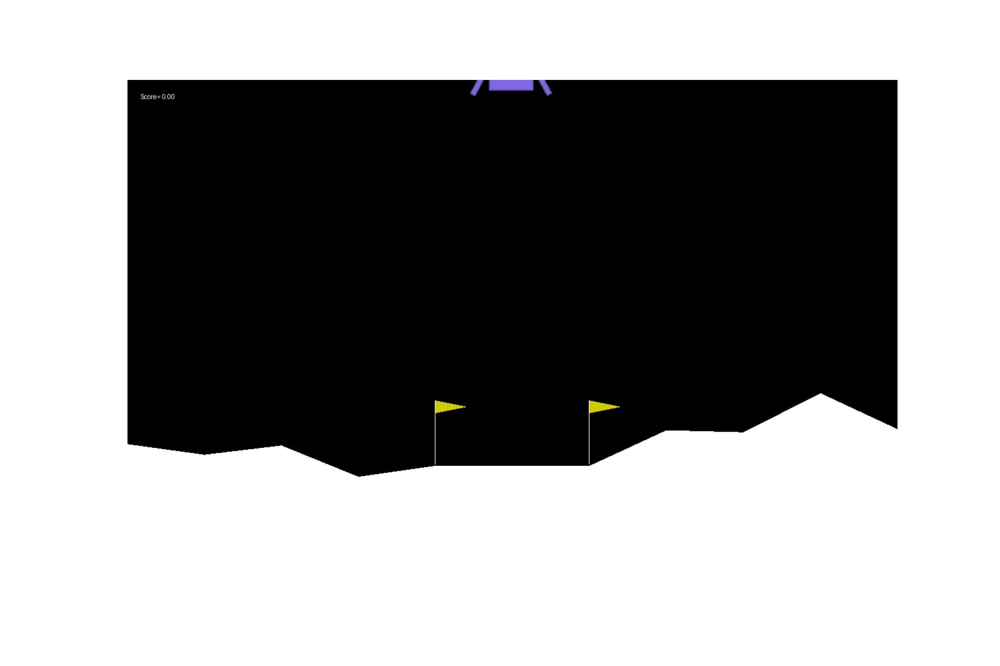

# LunarLander-DQN
Using a Deep Q Net to control the LunarLander environment from OpenAi's gym. Completed as my final project for RBE 595-ST Reinforcement Learning at WPI.

Check out my [presentation](Presentation.pdf)!

Example trials:

